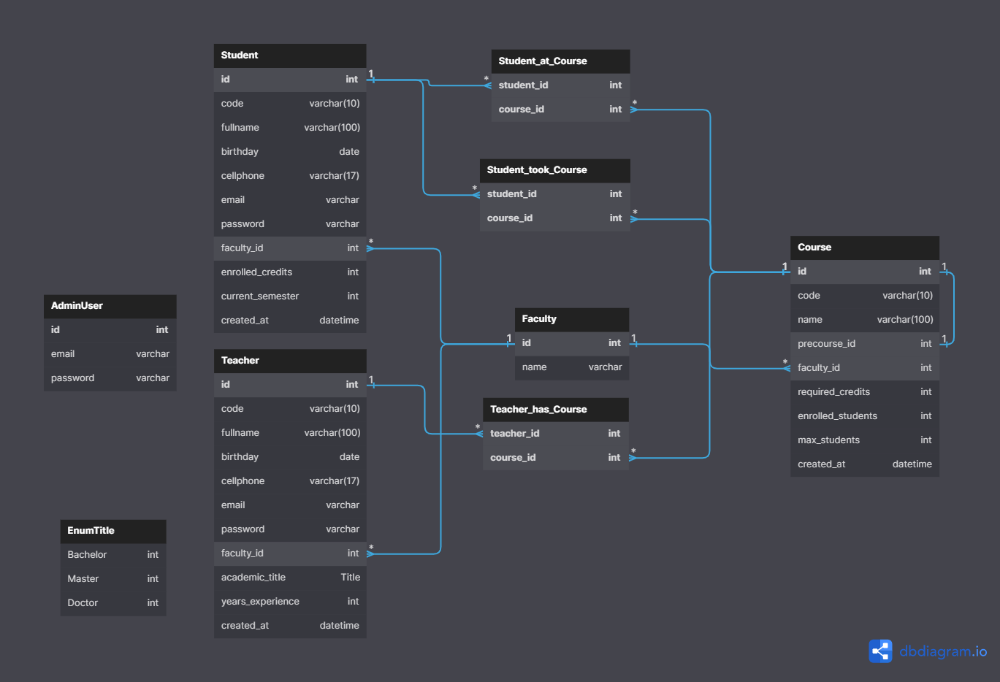

# SophosU
The platform for Sophos University to manage its institute information, offered courses, enrolled students and official teachers.

## Installation
1. Clone the repository
2. Enter the `/SophosAPI` folder and run `npm install`
3. Run `npm start` to start the server
4. Open `localhost:5000` in your browser
5. Enter the `/SophosApp` folder and run `npm install`
6. Run `npm preview` to start the app
7. Open `localhost:5173` in your browser

## Usage
1. Login with your credentials
3. Create a new course
4. Create a new teacher
5. Create a new student
6. Enroll the student to the course
7. Add the teacher to the course

## Database Model Diagram

## Development
There is the `/PoblationScripts` folder where you can find the scripts to create and populate a mysql database with data. You can run them in the following order:
1. `Database-Tables.sql`
2. `AdminUser.sql`
3. `Faculty.sql`
4. `Student.sql`
5. `Teacher.sql`
6. `Course.sql`
7. `Enrollment.sql` (This one must be manual, cause the enrrollement values are foreign keys)

## Docker Deployment
1. Clone the repository
2. Enter the `/SophosAPI` folder and run `docker compose -p api-prod -f docker-compose.yml up -d --build`
3. Enter the `/SophosApp` folder and run `docker compose -p webapp-prod -f docker-compose.yml up -d --build`
4. Open `localhost:8080` in your browser to see the API
4. Open `localhost:3030` in your browser to see the app

## License
[MIT](./LICENSE)
